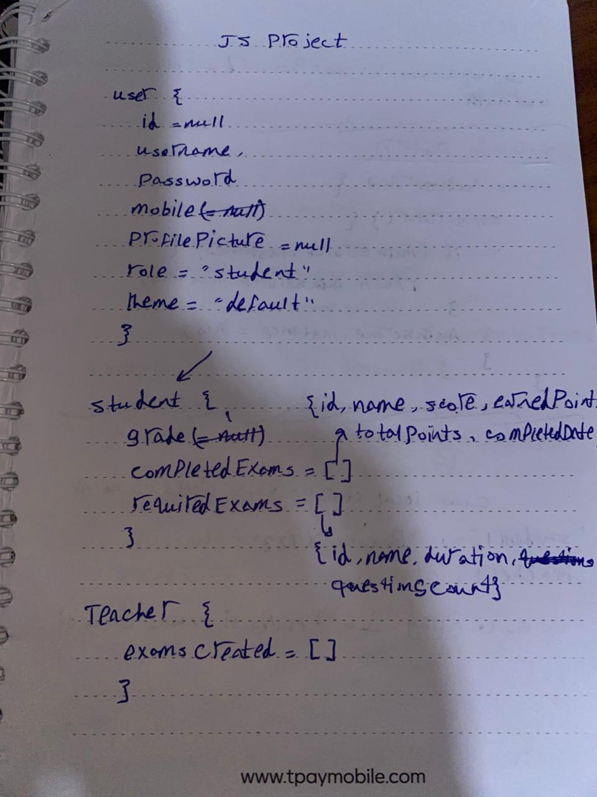
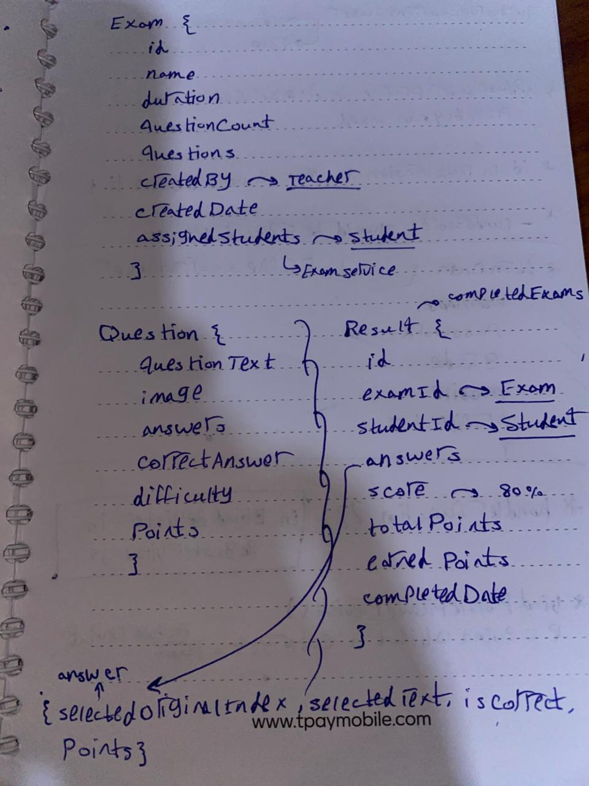

## emails
sameryousry99@gmail.com

eng.ali.essam@gmail.com
## Project README

## Handwritten Models Design

  
This diagram shows the top-level structure of the handwritten model, including the main components and their relationships.

  
This diagram expands on the second level, detailing subcomponents and their interactions.

## Project Overview

This project is a web-based application built using a clean MVC architecture.

The focus of the project is on architecture, collaboration, and scalable service-based design.

## Architecture

Pattern: MVC (Model – View – Controller)

The MVC structure was suggested by one of the team members based on backend Node.js experience.

The architecture was adopted to ensure:

Clear separation of concerns

Maintainable and scalable codebase

## UI & Animations

UI Design: AI-generated

UI Animations & Transitions: AI-generated and implemented

Meaninig of animations are keyframes for assurance

Manual adjustments were made where needed to fit the project structure.
## Team Contributions
## Team Member 1

Responsible for manual implementation of:

Registration

Login

Authentication Service

Theme Service

Student Profile

Exam Taking

Exam Results

## Team Member 2

Responsible for manual implementation of:

Exam Service

Teacher Dashboard

Analytics & Reporting

## Models

All models were designed by agreement between both team members.

This ensured consistency across services and features.

## Collaboration & Code Review

Any service created by one team member was reviewed by the other, since services represent the core foundation of the project.

This approach ensured:

Shared ownership

Code consistency

Easier future maintenance
